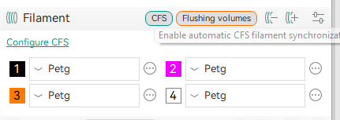
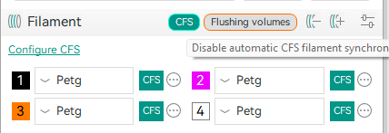
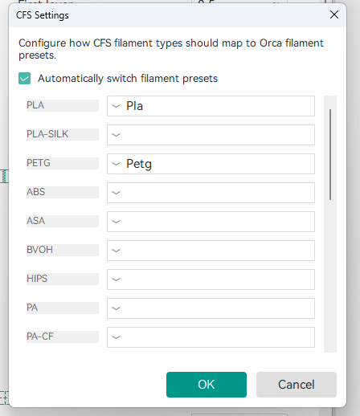

# OrcaSlicer CFS

This is an OrcaSlicer `v2.3.2` fork with native **Creality CFS** integration for the **K1 / K1C / K1 Max** family.

The goal of this fork is to make the filament workflow inside Orca much more direct:
- sync filament colors from CFS into Orca
- sync changes from Orca back to CFS
- switch filament presets based on material type
- keep an automatic mode that is visible, simple, and easy to configure

## What this fork adds

This fork adds:
- a `CFS` button in the filament sidebar
- visual sync status
- color sync from CFS to Orca
- color sync from Orca to CFS
- automatic filament preset switching by material type
- a CFS settings modal
- continuous sync when automatic mode is enabled

## Supported printers

The CFS button and integration are shown only when the active printer profile belongs to:
- `K1`
- `K1C`
- `K1 Max`

The printer also needs to be configured normally in Orca using its machine host settings.

## How it works

When `CFS` is disabled:
- Orca does not run automatic sync
- the button stays in its inactive state

When `CFS` is enabled:
- Orca starts following CFS updates
- filament color changes can be applied automatically
- if automatic preset switching is enabled, the filament preset can also be switched

When you change a color or preset in Orca:
- this fork can also push that change back to the CFS
- that affects the machine/CFS state, not only the local UI

## Tutorial

### 1. CFS disabled

Use this state when you do not want automatic sync.

In this state:
- automatic sync is off
- Orca will not keep pulling CFS updates on its own
- you can still prepare the configuration before enabling it

### 2. CFS enabled

When you enable `CFS`, the button changes to its active state.

In this state:
- Orca enters automatic sync mode
- new CFS updates can change filament colors in Orca
- if automatic preset switching is enabled, the preset can also be changed

### 3. CFS settings

Click `Configure CFS` to open the settings modal.

In this screen you can:
- enable or disable automatic filament preset switching
- choose which Orca preset should be used for each material type coming from CFS

Example:
- `PLA` -> your Orca PLA preset
- `PETG` -> your Orca PETG preset

Important:
- the selection made here controls automatic preset switching in the current project flow
- when outbound sync is enabled, changes made in Orca can also be pushed to the machine/CFS

## Supported sync flows

### CFS -> Orca

Supported:
- filament color
- material type
- automatic application when CFS sync is enabled

### Orca -> CFS

Supported:
- color changes made in Orca
- preset/material changes when preset mapping is configured

## Expected behavior

### If you change color in CFS

With `CFS` enabled:
- Orca receives the update
- the matching filament slot color is updated

### If you change color in Orca

When outbound sync is available:
- the fork sends that change to CFS
- the machine state is updated too

### If you change the preset in Orca

When automatic material mapping is enabled:
- the fork uses the configured mapping
- and can update the matching material state in CFS

## Notes

- this fork is built specifically for the **Creality CFS** workflow
- the main target is the **K1 / K1C / K1 Max** family
- the primary experience lives in the filament sidebar
- the CFS settings were kept inside a modal to avoid polluting the main interface

## Important limitation

This fork has only been tested with:
- standard **CFS**
- a **single CFS unit**

It has **not** been validated with:
- **CFS-C**
- multiple chained or multiple simultaneous CFS units

## Releases

Builds for this fork should be published in the repository releases as:
- Windows installer
- macOS build

## Project base

This fork is still based on:
- [OrcaSlicer](https://github.com/OrcaSlicer/OrcaSlicer)

## License

This repository continues to follow the same license as the upstream OrcaSlicer project.
